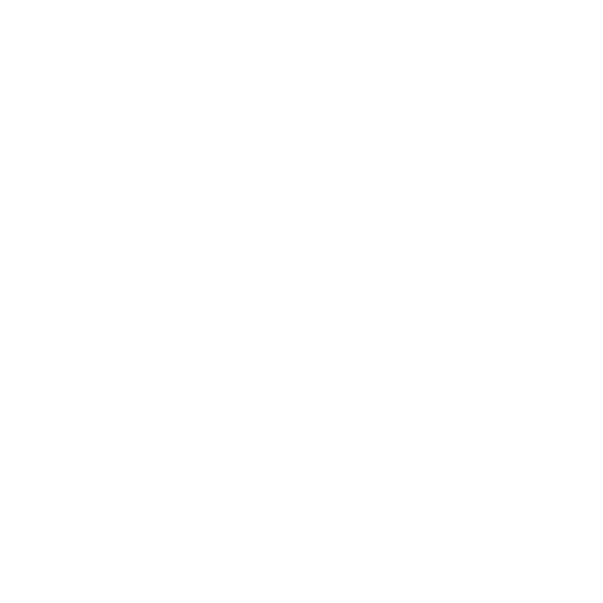

<div align="center">



# CodeTasker — Two-Way GitHub TODO & Task Management Engine

*Automatically convert inline code comments (TODO, FIXME, BUG) into interactive Kanban tasks, and inject them back into your codebase via automated Pull Requests.*

[Website](https://noirlang.tr) | [GitHub Repository](https://github.com/noirlang/codetasker) | [Contributing](CONTRIBUTING.md)

<video src="" width="700" controls></video>

</div>

## Overview

CodeTasker is an intelligent task synchronization platform that bridges the gap between your codebase and project management tools. It automatically scans your synchronized GitHub repositories for annotations like `// TODO:`, `// FIXME:`, `// BUG:`, `// HACK:`, and `// NOTE:`, maps them onto a visual Kanban board, and allows you to create and inject comments back into your code via automated Git branches and Pull Requests.

It is designed for engineering organizations of all sizes to eliminate technical debt tracking overhead and keep tasks perfectly in sync with the actual code.

## Features

Below is a detailed breakdown of the features provided by CodeTasker, explaining how each tool and system works to automate and streamline your workflow:

### 1. Push-to-Sync (Code to Board)
Automatically detects inline comments (like `// TODO:`, `// FIXME:`, `// BUG:`, `// HACK:`, `// NOTE:`) in your codebase whenever you push changes to GitHub. These comments are parsed and immediately synchronized as interactive tasks on your Kanban board.
* **How it works:** A webhook listener captures git commit pushes, analyzes files for annotation keywords, and registers or updates their lifecycle status inside MongoDB.
* **Visual Reference:**
  

### 2. Centralized Dashboard & Synced Repositories
Allows developers to view, filter, and manage all their connected repositories in one place. You can filter repositories by user or organization account, view active configurations, and instantly manage webhook sync options.
* **How it works:** Fetches repositories dynamically via the GitHub API, caching basic metadata in MongoDB while providing toggles to quickly install or remove webhooks on selected repositories.
* **Visual References:**
  
  

### 3. Task Injection (Board to Code)
Allows developers to inject inline code tasks directly into a file from the web UI. CodeTasker detects the file extension, structures the comment with the appropriate syntax (e.g. `# TODO:` for Ruby/Python, `// TODO:` for JavaScript/Go), writes it to the designated line, creates a new Git branch, and opens a GitHub Pull Request.
* **How it works:** Leverages GitHub Git Trees and Blobs API to write comments directly into targeted repository files on a newly created branch without messing up local workspace states.
* **Visual Reference:**
  

### 4. PR Management & Direct Merge
Provides a dedicated pane to monitor, review, and merge Pull Requests created by task injections. It simplifies the review cycle by allowing maintainers to execute merges directly from the app interface.
* **How it works:** Employs the GitHub PullRequests Merge API to execute merges (using standard, rebase, or squash options) without leaving the CodeTasker panel.
* **Visual Reference:**
  

### 5. Task Details & Team Collaboration
Allows team members to open any task, view its file location, change the assignee, modify tags, and collaborate directly on the issue via an interactive comments thread.
* **How it works:** Saves issue assignees and comments in MongoDB, linking task IDs with project collaborators to keep discussions unified.
* **Visual Reference:**
  

### 6. Multi-Channel Notifications (Telegram & Email Alerts)
Sends instant, real-time alerts through email and Telegram whenever a task is created, assigned, commented on, or completed. Users configure their custom Telegram bots inside settings to receive these alerts directly on mobile or desktop Telegram apps.
* **How it works:** Combines a transactional SMTP email engine with Telegram Bot's `sendMessage` API to deliver webhook-triggered notifications.
* **Visual References:**
  
  

### 7. Collaborators & Role-Based Access Control (RBAC)
Secures repository task boards by assigning specific workspace permissions (Viewer, Developer, Maintainer) to collaborators. It guarantees that only authorized users can perform write operations, modify tasks, or merge pull requests.
* **How it works:** Implements authorization checks within backend routes using JWT credentials mapped against synced repository contributor permissions.
* **Visual Reference:**
  

## System Architecture

CodeTasker is composed of three services:
1. **Frontend:** A responsive Single Page Application built with React, TypeScript, TailwindCSS, and Vite.
2. **Backend:** A high-performance REST API built with Go, Fiber, and the official Google Go-GitHub client.
3. **Database:** MongoDB for storing user sessions, synced repository configurations, collaborators, tasks, and audit logs.

## Requirements

Ensure you have the following installed on your machine:
- **Go** (version 1.21 or later)
- **Node.js** (version 18 or later) & **npm**
- **MongoDB** (running locally or accessible via URI)

## Local Development Setup

### 1. Environment Configuration

Create a `.env` file in the root directory (and copy it to both `backend/` and `frontend/` directories as needed). Define the following variables:

```env
PORT=8080
MONGO_URI=mongodb://localhost:27017
DB_NAME=codetasker
GITHUB_CLIENT_ID=your_github_oauth_client_id
GITHUB_CLIENT_SECRET=your_github_oauth_client_secret
GITHUB_REDIRECT_URL=http://localhost:8080/api/auth/github/callback
JWT_SECRET=your_jwt_signing_secret
WEBHOOK_SECRET=your_github_webhook_hmac_secret
TOKEN_ENCRYPT_KEY=your_aes_32byte_encryption_key
FRONTEND_URL=http://localhost:5173
```

### 2. Run the Backend

```bash
cd backend
go run cmd/server/main.go
```

### 3. Run the Frontend

```bash
cd frontend
npm install
npm run dev
```

The frontend will start at `http://localhost:5173/` and proxy API requests to `http://localhost:8080`.

## Quick Installation & Docker Setup

To quickly configure environment variables and launch the entire platform (MongoDB + Go API Backend + React Frontend) using Docker, run the interactive installation script at the project root:

```bash
./setup.sh
```

This script will:
1. Verify system prerequisites (`docker` and `docker compose`).
2. Prompt you step-by-step for configuration settings (Port, Database name, GitHub OAuth credentials, SMTP/email settings, etc.).
3. Auto-generate secure cryptographic keys if left blank (JWT secrets, AES-256 token encryption keys, webhook secrets).
4. Save the configuration to `.env` and offer to run the Docker Compose environment in the background automatically.

Alternatively, you can manually build and start the containers after creating your `.env` configuration:

```bash
docker compose up -d --build
```

## Contributing

Please review the [CONTRIBUTING.md](CONTRIBUTING.md) file for details on our code of conduct and the process for submitting pull requests.
